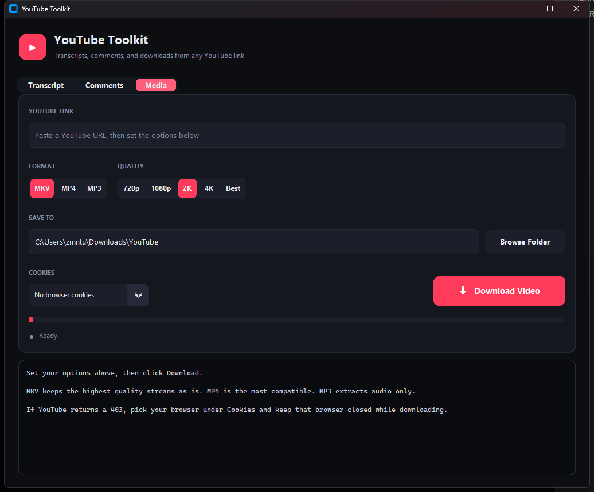

# YouTube Toolkit

A desktop app for pulling transcripts, comments, and media out of any YouTube
link. Built from `YouTube_Transcript_Comments_Video_Audio_Downloader.ipynb`.

## Setup

Double-click **`install.bat`** once. It creates a private Python environment in
`.venv`, installs the Python packages, and installs FFmpeg and Deno via winget.

Then double-click **`run.bat`** to start the app.

Rerun `install.bat` any time downloads start failing — it updates yt-dlp, which
is the usual fix.

## Using it

### Transcript tab
Paste a link, press **Enter**. The transcript is shown as timestamped
paragraphs and copied to your clipboard, prefixed with
`Summarize this YouTube Transcript -->`.

### Comments tab
Paste a link, press **Enter**. Fetches the top 3,000 comments, trims the
clipboard payload to 100,000 characters, and copies it with an
analysis-only preamble. Takes 20–60 seconds.

### Media tab
Paste a link, choose your options, then click **Download** (or press Enter in
the link box).

| Option | Choices |
| --- | --- |
| Format | MKV, MP4, MP3 |
| Quality | 720p / 1080p / 2K / 4K / Best — or 128–320 kbps for MP3 |
| Cookies | None, Chrome, Edge, Firefox, Brave |
| Save to | Type a path or click **Browse Folder** |

Picking MP3 swaps the quality row to bitrates automatically. The chosen folder
is remembered in `settings.json`.

## Files

| File | Purpose |
| --- | --- |
| `install.bat` | One-time setup |
| `run.bat` | Starts the app |
| `app.py` | The window, tabs, and widgets |
| `core.py` | Transcript, comment, and download logic (no UI) |
| `requirements.txt` | Python dependencies |

## Troubleshooting

**"FFmpeg was not found" / "Deno was not found"** — rerun `install.bat`. If it
still fails, sign out of Windows and back in so the new PATH entries register.

**HTTP 403 on a download** — nearly always means yt-dlp has fallen behind a
change on YouTube's side. YouTube reworks how it serves video every few weeks;
until yt-dlp catches up, downloads fail with 403 even though the link is fine.

**Fix: close the app and run `install.bat`.** It upgrades yt-dlp to the latest
release, which is usually all it takes. This was the entire cause of the 403s
seen on 2026-08-19: yt-dlp 2026.7.4 failed on every video and every quality,
and 2026.8.19 fixed it with no other change.

It is worth updating *first*, before changing any setting in the app. If it
still fails immediately after updating, wait an hour in case your connection is
being rate limited, try a second video to see whether it is specific to one,
and check [the yt-dlp issues](https://github.com/yt-dlp/yt-dlp/issues) for an
open report.

**The Cookies dropdown does nothing on Chrome or Edge** — Chromium's app-bound
encryption blocks yt-dlp from reading their cookie stores on Windows
([issue #10927](https://github.com/yt-dlp/yt-dlp/issues/10927)). Only Firefox
cookies are usable. For a 403, update yt-dlp instead — cookies are not the fix.

**`CERTIFICATE_VERIFY_FAILED`** — antivirus and corporate proxies re-sign HTTPS
traffic with their own root certificate. `core.py` handles this by routing
verification through the Windows certificate store via `truststore`.

**The app does not open** — check `error.log` next to `app.py`. `run.bat` uses
`pythonw.exe`, so there is no console window to read errors from.
